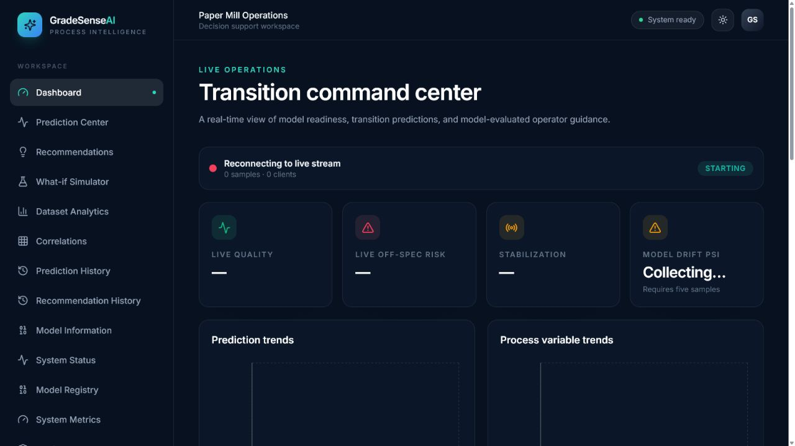
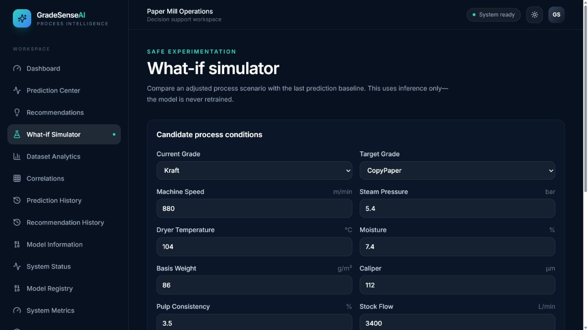
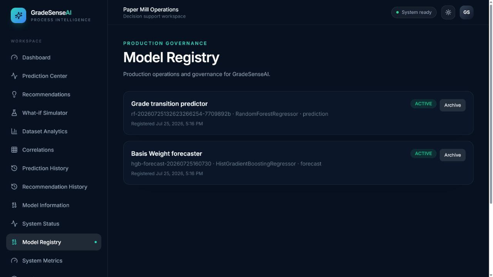
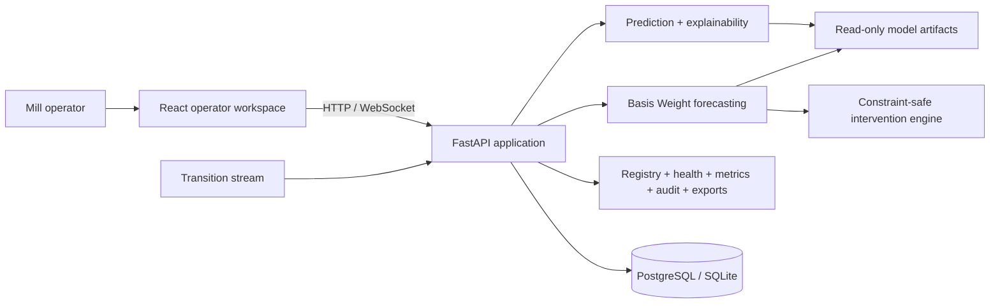

# Honeywell GradeSenseAI

GradeSenseAI is an industrial decision-support platform for paper-grade transitions. It combines
live process monitoring, multi-horizon Basis Weight forecasting, constraint-safe intervention
simulation, operator workflow tracking, model governance, and production observability in one
deployable application.

This repository is the final Honeywell Hackathon submission candidate. Production demos load the
supplied pre-trained artifacts and never train or generate data automatically during startup.
The explicit `/dataset/regenerate` compatibility endpoint and offline scripts remain available for
controlled development and experimentation.

## Honeywell challenge mapping

| Manufacturing need | GradeSense capability |
| --- | --- |
| Detect transition risk before paper becomes off-spec | Direct multi-horizon Basis Weight forecast with ±2.5% specification monitoring |
| Estimate when a deviation will occur | First-crossing step/time and remaining safe operating time |
| Tell the operator what to do | Forecast-backed single and multi-variable intervention ranking |
| Keep recommendations safe | Equipment, grade, range, rate-of-change, and dependency constraints |
| Explain the decision | Forecast causes, trajectory effect, risks, confidence bands, and uncertainty |
| Capture human decisions | Persistent accept, reject, modify, delay, apply, expire, and evaluate lifecycle |
| Learn whether advice worked | Outcome accuracy, avoided/delayed crossings, deviation and stabilization metrics |
| Operate as a governed industrial service | Model Registry, promotion validation, audit log, health, metrics, exports, and security middleware |

## Product screenshots

### Transition command center



### What-if simulation



### Model Registry



## Architecture



Detailed diagrams and design decisions are in
[SYSTEM_ARCHITECTURE.md](docs/SYSTEM_ARCHITECTURE.md).

## Forecasting pipeline

Ordered samples are grouped by transition; windows never cross a transition boundary. The shared
temporal feature engineer derives lags, rolling statistics, derivatives, target distance,
transition progress, and grade-pair encoding. Direct horizon regressors produce the future Basis
Weight trajectory, validation residuals produce 90% confidence intervals, and a crossing
classifier estimates the probability of leaving the ±2.5% band.

The production artifact is loaded read-only and cached by immutable artifact path. See
[MODEL_OVERVIEW.md](docs/MODEL_OVERVIEW.md) for data boundaries, features, metrics, limitations,
and validation behavior.

## Intervention engine

For each persisted forecast, GradeSense enumerates feasible setpoint changes across stock flow,
filler flow, steam pressure, machine speed, dryer temperature, and reel tension. Every feasible
candidate is re-run through the active forecasting model. Candidates are ranked only from predicted
crossing-risk, peak-deviation, and stabilization improvement; unsafe or non-improving candidates
are omitted.

The intervention engine never applies equipment setpoints. It produces decision support for a
human operator and records the resulting lifecycle and observed outcome.

## Model Registry

The registry stores immutable versions for prediction and forecasting model families, including
artifact, dataset, and feature-schema checksums. Promotion verifies artifact existence, checksum,
required metadata, metrics, schema compatibility, and pipeline interfaces. Inference resolves the
active version at runtime, so promotion requires no FastAPI restart. An active model cannot be
archived until a replacement is promoted.

## Technology stack

| Area | Technology |
| --- | --- |
| Backend | Python 3.13, FastAPI, Pydantic v2, SQLAlchemy 2, Alembic |
| Intelligence | pandas, NumPy, scikit-learn, joblib |
| Frontend | React 19, TypeScript, Vite, Tailwind CSS, TanStack Query, Zustand, Recharts |
| Persistence | PostgreSQL in deployment; SQLite for local development/tests |
| Runtime | Docker Compose, Uvicorn, Nginx |
| Quality | Pytest, Ruff, Black, Vitest, Testing Library, ESLint, Prettier |

## Directory structure

```text
GradeSense/
├── backend/
│   ├── alembic/                 schema migrations
│   ├── app/
│   │   ├── api/routes/          HTTP and WebSocket endpoints
│   │   ├── config/              typed environment configuration
│   │   ├── core/                logging and exception handling
│   │   ├── database/            engine and sessions
│   │   ├── domain/              canonical process contracts
│   │   ├── models/              relational models
│   │   ├── schemas/             public Pydantic contracts
│   │   └── services/            intelligence and operational services
│   └── tests/
├── data/                        supplied snapshot and sequential datasets
├── docs/                        submission documentation and screenshots
├── frontend/src/                operator and administration UI
├── models/                      supplied immutable joblib artifacts
├── scripts/                     explicit offline generation/training utilities
└── docker-compose.yml
```

## Quick start with Docker

Prerequisites: Docker Desktop with the Linux engine and Docker Compose.

```bash
docker compose up --build
```

Open:

- Operator UI: `http://localhost:5173`
- API: `http://localhost:8000`
- OpenAPI: `http://localhost:8000/docs`

Both supplied datasets and both supplied model artifacts are mounted read-only. PostgreSQL data is
stored in the `postgres_data` volume. See [DEPLOYMENT.md](docs/DEPLOYMENT.md) for production
configuration, health checks, persistence, security, and troubleshooting.

## Local development

Backend:

```bash
cd backend
python -m venv .venv
.venv\Scripts\activate
pip install -e ".[dev]"
alembic upgrade head
uvicorn app.main:app --reload
```

Frontend:

```bash
cd frontend
npm ci
npm run dev
```

The API requires the checked-in files under `data/` and `models/`. If an artifact is missing,
startup fails with an explicit error rather than training automatically.

## API overview

Primary groups:

- `/predict`, `/recommend`, `/correlations`, `/dataset/statistics`, `/model/info`
- `/forecast`, `/forecast/history`, `/forecast/simulate`, `/relationships/discovery`
- `/interventions/recommendations`, decisions, outcomes, and effectiveness
- `/alerts`, `/feedback`, `/metrics/live`, `/metrics/rolling`, `/stream/status`
- `/models`, `/models/active`, registration, promotion, and archive
- `/admin/system`, health, metrics, audit, configuration, exports, and models
- `/ws/live` and `/ws/dashboard`

All request/response contracts and status codes are documented in
[API_REFERENCE.md](docs/API_REFERENCE.md) and the generated OpenAPI UI.

## Demonstration

The recommended eight-minute judge flow and reproducible sample scenarios are in
[DEMO_GUIDE.md](docs/DEMO_GUIDE.md). A strong path is:

1. Show the live Newsprint → CopyPaper transition and forecast crossing.
2. Compare baseline and intervention trajectories in the simulator.
3. Generate ranked multi-variable recommendations.
4. Accept or delay one recommendation and show its audit entry.
5. Review model versions and active-model governance.
6. Show measured health/latency and export the audit trail as CSV.

## Testing and quality gates

```bash
cd backend
python -m pytest
python -m ruff check app tests
python -m black --check app tests

cd ../frontend
npm test -- --run
npm run lint
npm run format
npm run build

cd ..
docker compose config --quiet
```

The test suite covers forecasting, intervention generation, constraints, recommendation lifecycle,
outcomes, WebSockets, model registration/promotion/archive, runtime switching, health, metrics,
audit, configuration, exports, security middleware, and legacy regression paths.

## Known limitations

- Synthetic process data demonstrates architecture and decision flow; production use requires a
  validated mill historian/OPC adapter and site acceptance testing.
- Recommendations are advisory and never write directly to a DCS or PLC.
- Every recommendation carries structured inference sources. Forecast-backed actions identify
  forecast, historical-trend, correlation, applicable recipe-constraint, and historical successful
  transition evidence.
- Historical recommendation evidence is advisory: recommendations with the same grade transition
  and overlapping affected variables are summarized by similar-transition count, acceptance rate,
  and mean evaluated recommendation accuracy. This evidence does not retrain the model or perform
  reinforcement learning.
- Recipe attribution names each grade-specific rule that validated a proposed setpoint and surfaces
  those rules in the operator explanation.
- The in-process WebSocket broadcaster, metrics buffer, and rate limiter are intended for a
  single API replica. Multi-replica deployment requires a shared broker and metrics backend.
- SQLite is convenient for development but PostgreSQL is required for concurrent production use.
- No authentication or role-based authorization is included by design; deploy behind the mill's
  identity-aware gateway.
- Outcome evaluation requires the caller to submit aligned future observations.

## Future work

Future work is intentionally outside this submission: real historian ingestion, mill-specific
constraint commissioning, identity integration, distributed streaming, long-term metrics storage,
formal model approval workflows, and controlled DCS integration.

## Documentation

- [System architecture](docs/SYSTEM_ARCHITECTURE.md)
- [API reference](docs/API_REFERENCE.md)
- [Deployment guide](docs/DEPLOYMENT.md)
- [Model overview](docs/MODEL_OVERVIEW.md)
- [Demo guide](docs/DEMO_GUIDE.md)
