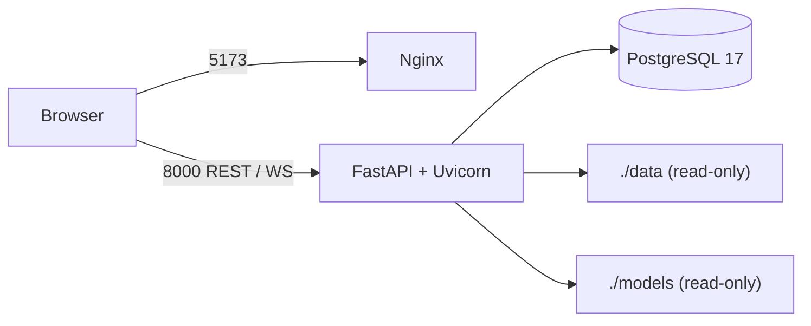

# Deployment Guide

## Reference deployment

Docker Compose runs PostgreSQL, FastAPI, and an Nginx-served React build. Dataset and model
directories are mounted read-only; PostgreSQL uses a durable named volume.



## Prerequisites

- Docker Desktop or Docker Engine with Compose v2
- Linux container engine running
- Ports 5173 and 8000 available
- At least 1 GB free memory beyond Docker overhead

Verify required artifacts:

```bash
test -f data/generated/paper_mill_transitions.csv
test -f data/sequential/paper_mill_transition_sequences.csv
test -f models/grade_transition_model.joblib
test -f models/basis_weight_forecast.joblib
```

PowerShell equivalents use `Test-Path`.

## Start and verify

```bash
docker compose config --quiet
docker compose up --build -d
docker compose ps
curl http://localhost:8000/health
curl http://localhost:8000/admin/health
```

Open `http://localhost:5173`. Stop with `docker compose down`. Do not add `--volumes` unless
PostgreSQL history should be intentionally removed.

## Environment configuration

All environment variables use the `GRADESENSE_` prefix.

| Variable | Purpose |
| --- | --- |
| `GRADESENSE_ENVIRONMENT` | development, test, staging, or production |
| `GRADESENSE_DATABASE_URL` | SQLAlchemy database URL |
| `GRADESENSE_CORS_ORIGINS` | JSON list of allowed frontend origins |
| `GRADESENSE_DATASET_PATH` | Snapshot dataset path |
| `GRADESENSE_SEQUENTIAL_DATASET_PATH` | Ordered transition dataset path |
| `GRADESENSE_MODEL_PATH` | Snapshot model path |
| `GRADESENSE_FORECAST_MODEL_PATH` | Forecast artifact path |
| `GRADESENSE_STREAM_INTERVAL_SECONDS` | Initial replay interval |
| `GRADESENSE_LOG_LEVEL` | Structured log level |

Runtime-adjustable operational values are available through `/admin/config`; environment values
remain the startup defaults.

## Database

The backend container runs `alembic upgrade head` before Uvicorn. PostgreSQL is health-checked
before backend startup. Back up the `postgres_data` volume using the platform's standard PostgreSQL
backup process.

Never downgrade a production database without a tested backup and maintenance window.

## Health and readiness

- `/health`: lightweight API liveness
- `/admin/health`: database, models, forecasting, intervention, stream, WebSocket, datasets,
  resources, and uptime
- frontend `/healthz`: Nginx liveness

Container orchestration should use liveness separately from deeper readiness checks.

## Security

The application supplies request IDs, explicit CORS, security headers, request-size enforcement,
validation, and local rate limiting. Production deployment must additionally provide:

- HTTPS/TLS termination;
- authentication and role-based access through an identity-aware gateway;
- secrets management for database credentials;
- network policies restricting PostgreSQL and administration routes;
- centralized audit/log retention;
- artifact signing and controlled model-release access.

The included database password is for local Compose only.

## Scaling

The reference configuration uses one backend replica because streaming state, WebSocket clients,
latency buffers, and rate-limit state are process-local. Multiple replicas require:

- a shared stream/message broker;
- WebSocket fan-out or sticky sessions;
- centralized rate limiting;
- Prometheus/OpenTelemetry or an equivalent metrics backend;
- coordinated single-writer ingestion semantics.

## Troubleshooting

| Symptom | Check |
| --- | --- |
| Docker build cannot connect | Start the Docker Linux engine |
| Backend exits during startup | Verify all four read-only data/model files exist |
| UI cannot call API | Confirm `VITE_API_URL` and the exact CORS origin |
| Forecast returns 503 | Verify the active forecast artifact and registry checksum |
| Registry promotion returns 422 | Read the validation detail; verify path, checksums, schema, metrics, and pipeline |
| WebSocket disconnected | Check reverse-proxy upgrade headers and idle timeouts |

