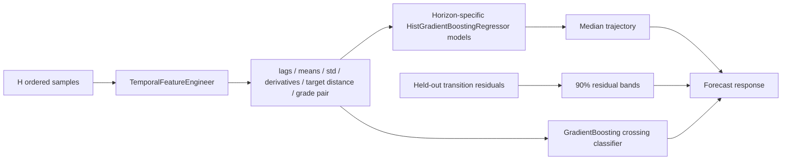
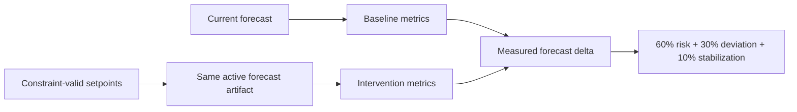

# Model Overview

## Model families

| Family | Purpose | Artifact |
| --- | --- | --- |
| Snapshot prediction | Quality score, off-spec probability, stabilization time | `models/grade_transition_model.joblib` |
| Sequential forecast | Future Basis Weight trajectory and crossing probability | `models/basis_weight_forecast.joblib` |

Both artifacts are supplied with the repository and loaded read-only. Training utilities exist only
as explicit offline scripts; application startup and request paths never train.

The backend pins scikit-learn 1.9.0 because that is the serialization version embedded in the
forecast artifact. Exact runtime compatibility avoids unsupported cross-version unpickling.

## Snapshot prediction model

The snapshot artifact contains one preprocessing/model pipeline:

- median imputation and scaling for numeric features;
- mode imputation and one-hot encoding for current/target grade;
- multi-output Random Forest regression;
- training baselines and global feature importance;
- dataset checksum, model version, training timestamp, records, and validation metrics.

Inputs include grade identity, speed, steam pressure, dryer temperature, moisture, Basis Weight,
caliper, pulp consistency, stock flow, refining energy, headbox pressure, reel tension, ambient
temperature, and humidity.

Local explanations replace one input at a time with its learned baseline and measure the change in
predicted off-spec probability. This is a counterfactual sensitivity explanation, not a causal
claim.

## Sequential forecasting model

Training and validation split by entire transition, not individual rows. The model therefore does
not learn from future rows of the same transition during validation. The direct multi-horizon
design predicts every supported future step independently.

Confidence intervals are empirical validation-residual envelopes. Response confidence decreases as
the average interval width grows relative to the target Basis Weight.

## Specification and stabilization definitions

- Lower/upper limits: target Basis Weight ±2.5%.
- Crossing: first median trajectory point outside that band.
- Remaining safe time: sample interval multiplied by first crossing step.
- Stabilization: first point starting three consecutive predictions within ±1%.

## Intervention evaluation

Confidence is the lower of baseline and intervention forecast confidence. No constant or random
confidence is introduced. Constraints run before inference; non-improving candidates are omitted.

## Registry validation

Promotion checks:

1. artifact file exists;
2. SHA-256 matches registry metadata;
3. artifact version matches registered version;
4. feature-schema checksum matches the expected family schema;
5. required metadata and metrics exist;
6. prediction or forecasting pipeline exposes required inference interfaces.

Inference resolves the active registry entry once per request and caches the deserialized artifact
by immutable path.

## Reproducibility

The supplied artifacts include version, timestamps, metrics, and data/schema checksums. Offline
training scripts use explicit seeds. Model creation is not part of the demo or deployment flow.

## Limitations

- Data is synthetic and represents plausible process relationships rather than a specific mill.
- Residual intervals are empirical and not a formal probabilistic calibration guarantee.
- Feature sensitivity explanations do not prove process causality.
- Production acceptance requires mill data validation, instrumentation reconciliation, and
  operator/process-engineer review.
- Models should be monitored by grade family and operating regime after deployment.
