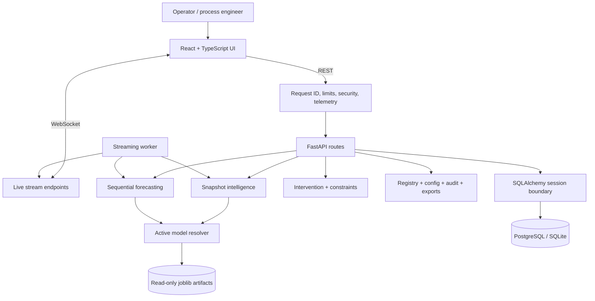
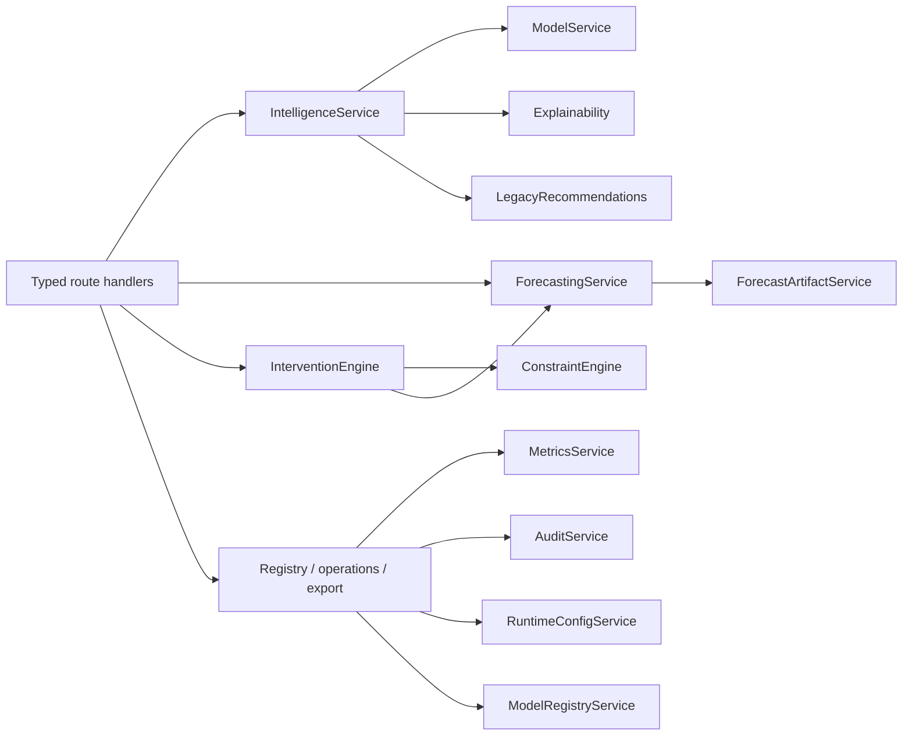
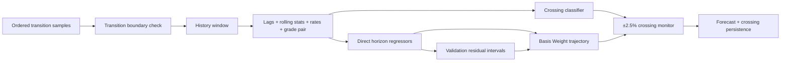
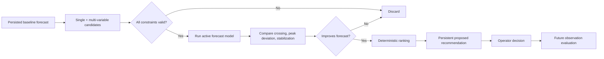
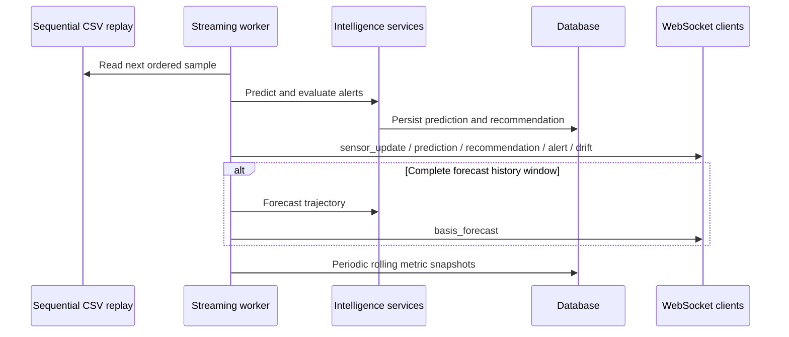
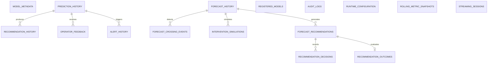
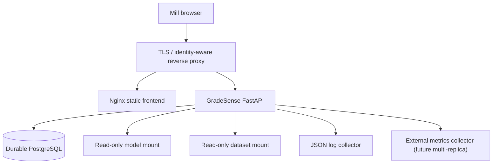

# GradeSenseAI System Architecture

## Overall architecture

## Backend services

Routes own HTTP semantics; services own behavior; schemas define public contracts; SQLAlchemy models
define persistence. Forecasting and intervention services remain isolated from administrative
concerns except for active artifact resolution.

## Forecast pipeline

## Recommendation pipeline

## Streaming architecture

The worker is single-process by design. Its queues are bounded. A transition-ID change clears the
forecast history, preventing windows from crossing grade-transition boundaries.

## Database schema

UUID primary keys and timestamps are consistent across operational tables. JSON columns retain
model-specific trajectory, metric, explanation, and input structures while indexed relational
columns support identity, state, time, and foreign-key access paths.

## Deployment architecture

Docker Compose implements the single-node reference deployment. Production should provide TLS,
identity, secrets, backups, log retention, and network policy outside the application container.

## Key architectural decisions

- Direct horizon models avoid autoregressive error accumulation and keep inference explainable.
- Model and dataset artifacts are read-only at runtime; missing artifacts fail startup.
- Model versions are immutable and promotion is an atomic registry status change.
- Recommendations are simulated, constrained, explainable, persistent, and advisory.
- Existing snapshot APIs remain separate for backward compatibility.
- In-memory stream/metric buffers are bounded to prevent unbounded process growth.
- Audit persistence is append-only and cannot turn a successful domain response into a failure.
- Operational middleware is centralized so request IDs and security controls cover all HTTP APIs.

